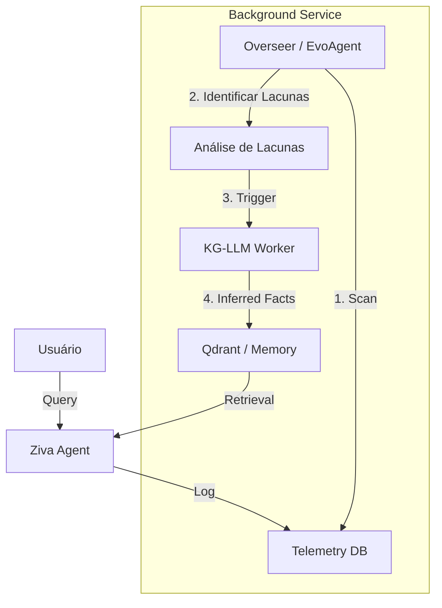

# Análise de Pesquisa: PowerDrill Digest

**Data:** 16/01/2026
**Fonte:** [PowerDrill Research Digest](https://powerdrill.ai/blog/research-digest)
**Foco:** Agentes Autônomos, RAG Local e Knowledge Graphs.

## 1. Visão Geral

A análise do digest revelou dois papers/artigos de alta relevância para a arquitetura evolutiva da Ziva:

1.  **Demonstration of DB-GPT**: Um framework para interação de dados seguro e local.
2.  **Relations Prediction for Knowledge Graph Completion using LLMs**: Uso de LLMs para inferir conexões latentes em grafos.

---

## 2. Deep Dive: DB-GPT

**Link:** [Demonstration of DB-GPT](https://powerdrill.ai/blog/demonstration-of-db-gpt-next-generation-data-interaction-system-empowered-by-large-language-models)

### Conceitos Chave

- **Privacidade em Primeiro Lugar**: Assim como Ziva, o DB-GPT foca em ambientes onde dados não podem vazar.
- **SMMF (Service-oriented Multi-model Management Framework)**: Uma camada que abstrai diferentes backends de LLM (Local, vLLM, API), similar ao `core/llm.py` da Ziva, mas mais padronizada.
- **AWEL (Agentic Workflow Expression Language)**: Uma linguagem para definir fluxos de agentes.
- **Multi-Agentes para Análise de Dados**: Especialização de agentes (e.g., um para SQL, um para Charting, um para Report).

### Aplicabilidade na Ziva

- **Validar Arquitetura**: A escolha da Ziva de rodar Local RAG + Qwen confirma a tendência da indústria (DB-GPT usa Qwen/GLM).
- **Evolução da API**: Podemos adotar um padrão similar ao SMMF para permitir que a Ziva troque de "cérebro" (e.g., de Ollama para vLLM) sem reiniciar, via API de admin.
- **Data Analyst Persona**: O DB-GPT usa agentes para gerar relatórios de vendas/dados. Ziva pode incorporar um "Data Node" especializado que gera Python/Pandas para responder perguntas complexas sobre dados (CSV/SQL).

---

## 3. Deep Dive: Knowledge Graph Completion (KGC)

**Link:** [Relations Prediction for Knowledge Graph Completion](https://powerdrill.ai/blog/relations-prediction-for-knowledge-graph-completion-using-large-language-models)

### Conceitos Chave

- **LLMs como Preditores de Arestas**: Em vez de apenas buscar no grafo, o LLM recebe dois nós e prevê a relação, ou recebe um nó e relação e prevê o alvo.
- **Text-Centric**: Usa as descrições textuais dos nós (embeddings) para ajudar na predição, superando métodos puramente estruturais (TransE).

### Aplicabilidade na Ziva (Memória Episódica)

- **Consolidação de Memória (Sonho)**: Durante o "sono" (offline processing), a Ziva pode ler sua memória episódica (Qdrant) e usar o LLM para encontrar conexões não óbvias entre fatos disconexos.
  - _Exemplo_: Fato A="Usuário gosta de Python". Fato B="Usuário perguntou sobre Flask". A Ziva infere: Fato C="Usuário é desenvolvedor web".
- **Node de "Inferência Latente"**: Um novo nó no LangGraph que roda em background (Overseer) para enriquecer o Knowledge Graph.

---

## 4. Takeaways e Ações Recomendadas

### Imediato (Fase C - Avaliação)

- [ ] **Incorporar Métricas de KGC no Overseer**: O avaliador interno pode tentar prever se a resposta atual contradiz fatos passados (Consistência).

### Médio Prazo (Fase D - Expansão)

- [ ] **Adotar Padrão SMMF**: Refatorar `core/llm.py` para suportar hot-swap de modelos (útil para trocar entre modelos "Fast" e "Deep Thinking").
- [ ] **Data Analyst Tool**: Criar uma tool que aceita CSVs e executa pandas (inspirado no DB-GPT).

### Longo Prazo (Memória Infinita)

- [ ] **Active Graph Completion**: Usar o tempo ocioso para preencher lacunas no Knowledge Graph do usuário usando a técnica de _Relation Prediction_ descrita.

---

## 5. Deep Dive: Self-Improving Data Agents

**Link:** [Self-Improving Data Agents](https://powerdrill.ai/blog/self-improving-data-agents)

### Conceitos Chave

- **Trindade da Auto-Melhoria**:
  1.  **Reinforcement Learning (RL)**: _Trial-and-error_. O agente tenta uma ação, recebe feedback (humano ou automático) e ajusta sua política.
  2.  **Meta-Learning**: "Aprender a aprender". Adaptar-se a novos domínios com poucos exemplos (Few-Shot).
  3.  **Recursive Self-Improvement (RSI)**: O nível mais avançado, onde o agente reescreve seu próprio código ou prompts (ex: _Gödel Agent_).

### Aplicabilidade na Ziva

- **Reflexão como RL Simplificado**: O módulo `ReflectionManager` (Fase B/C) já atua como um loop de RL primitivo. Ao criticar sua própria resposta ("score": 3/5), a Ziva gera um sinal negativo que pode ser usado para ajustar o próximo prompt.
- **Meta-Learning na Memória Episódica**: Ao recuperar exemplos passados de sucesso (`EpisodicMemory`), a Ziva está efetivamente fazendo _Few-Shot Learning_ dinâmico, adaptando-se ao estilo do usuário sem re-treino.
- **Rumo ao RSI (Fase E)**:
  - O `Overseer` (Fase C) pode evoluir para um "Prompt Engineer Automático". Se ele notar que a tool `web_search` falha muito com queries vagas, ele poderia propor uma alteração no template `TRANSFORM_QUERY_PROMPT`.
  - _Ação_: Criar um backlog de "Sugestões do Overseer" que o humano aprova, fechando o loop semi-autônomo.

### Recomendação Atualizada

- [ ] **Evoluir Overseer para "Gödel Lite"**: Permitir que o Overseer sugira _patches_ para os arquivos de prompt (`core/agent/prompts.py`).

---

## 6. Recursos e Códigos Open-Source (GitHub)

Pesquisa realizada em 16/01/2026 focada em implementações práticas.

### A. Agentes Auto-Evolutivos

1.  **[EvoAgentX](https://github.com/EvoAgentX/EvoAgentX)**:
    - _O que é_: Framework para construção automática e evolução de agentes.
    - _Uso na Ziva_: O "Self-Evolution Engine" deles pode inspirar nosso `Overseer`. Ver como eles implementam a métrica de "Fitness" para agentes.
2.  **[LangChain Self-Improving Agent](https://github.com/langchain-ai/langchain)**:
    - _O que é_: Padrões de reflexão e loop de aprendizado.
    - _Uso na Ziva_: Confirmar se nossa implementação em `core/reflection.py` segue as melhores práticas da comunidade (nós já usamos um Reflection Loop similar).
3.  **[Gödel Agent](https://github.com/xlang-ai/Godel-Agent)**:
    - _O que é_: Protótipo de RSI (Recursive Self-Improvement).
    - _Uso na Ziva_: Referência de longo prazo para permitir que a Ziva edite seu próprio código Python (extremamente arriscado, mas poderoso).

### B. Knowledge Graph Completion (KGC)

1.  **[KG-LLM (yao8839836)](https://github.com/yao8839836/kg-llm)**:
    - _O que é_: Implementação direta do paper analisado na Seção 3.
    - _Uso na Ziva_: Clonar/adaptar os scripts de _Instruction Finetuning_ para ensinar o Qwen a extrair triplas `(Sujeito, Predicado, Objeto)` de textos não estruturados.
2.  **[AI Knowledge Graph Generator](https://github.com/robert-mcdermott/ai-knowledge-graph)**:
    - _O que é_: Extrator de triplas SPO visualizável.
    - _Uso na Ziva_: Candidato forte para integrarmos um "Visualizador de Memória" no frontend.

### C. DB-GPT

1.  **[eosphoros-ai/DB-GPT](https://github.com/eosphoros-ai/DB-GPT)**:
    - _Status_: Projeto maduro (+10k stars).
    - _Ação_: Estudar o código fonte de _PrivateKB_ (Knowledge Base Privada) para melhorar nosso `core/rag_helper.py`.

### Conclusão Prática

A comunidade Open-Source já possui "blocos de montar" para todas as fases do nosso plano. Não precisamos reinventar a roda, apenas orquestrar esses componentes (`Overseer` orquestrando o código do `kg-llm`).

---

## 7. Estratégia de Integração Híbrida (Overseer + KGC)

**Solicitação:** Análise de compatibilidade e implementação conjunta de Agentes Auto-Evolutivos e Knowledge Graph Completion.

### Análise de Compatibilidade

Estas duas tecnologias não apenas são compatíveis, como são **multiplicadoras de força** quando combinadas.

- **A "Mente" (Overseer/EvoAgent)**: Precisa de dados estruturados para tomar decisões de melhoria.
- **A "Memória" (KGC)**: Precisa de um processo inteligente para ser curado e expandido, já que é caro computacionalmente.

### Arquitetura Proposta: "The Gardener Cycle" (O Ciclo do Jardineiro)

Em vez de processos isolados, o `Overseer` atua como o jardineiro da memória.

1.  **Fase de Ação (Online)**:
    - Ziva responde usuários usando o grafo atual.
    - Logs são gerados (`telemetry.jsonl`).
2.  **Fase de Avaliação (Overseer - Loop Curto)**:
    - Overseer lê logs. Detecta falhas de resposta por "Lack of Context".
3.  **Fase de Expansão (KGC - Loop Longo)**:
    - Overseer aciona o módulo `KG-LLM` especificamente nos tópicos onde houve falha.
    - _Exemplo_: Usuário perguntou sobre "Dark Matter" e falhou. Overseer ordena: "Rode KGC no cluster de Física".
    - O LLM infere novas arestas no grafo (predição de relação).
4.  **Fase de Validação (Reflexão)**:
    - Overseer verifica se as novas arestas melhoram as respostas em simulação.

### Diagrama de Fluxo

### Implementação Prática na Ziva

1.  **Worker de KGC**: Criar `scripts/workers/kg_completion.py` (baseado em `kg-llm`) que aceita um tópico e gera triplas.
2.  **Scheduler no Overseer**: Adicionar lógica no `core/overseer.py` para chamar esse worker quando a `tool_success_rate` de recuperação for baixa.
